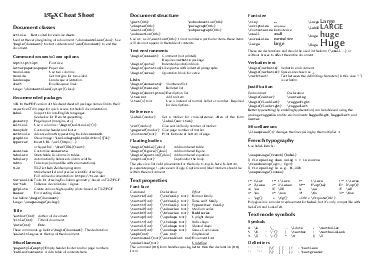
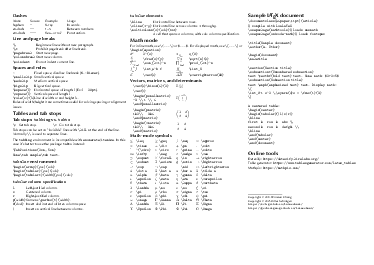

---
---

## LaTeX cheat sheet

This is a latex reference sheet which is geared toward writing short documents
e.g. math exercise sheets. It is a fork of the excellent LaTeX cheat sheet by
Winston Chang: https://wch.github.io/latexsheet/

PNG images of the reference sheet:

### Download

[PDF](latexsheet-a4.pdf) (A4) |
[LaTeX](latexsheet.tex)

### License

 This work is licensed under a <a rel="license" href="http://creativecommons.org/licenses/by-nc-sa/3.0/">Creative Commons Attribution-NonCommercial-ShareAlike 3.0 Unported License</a>.
